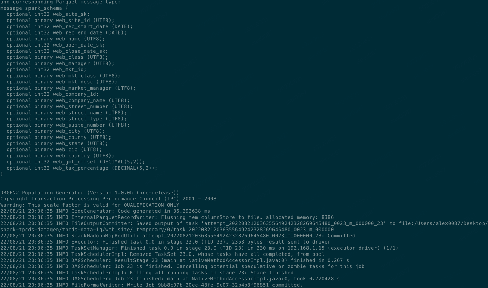
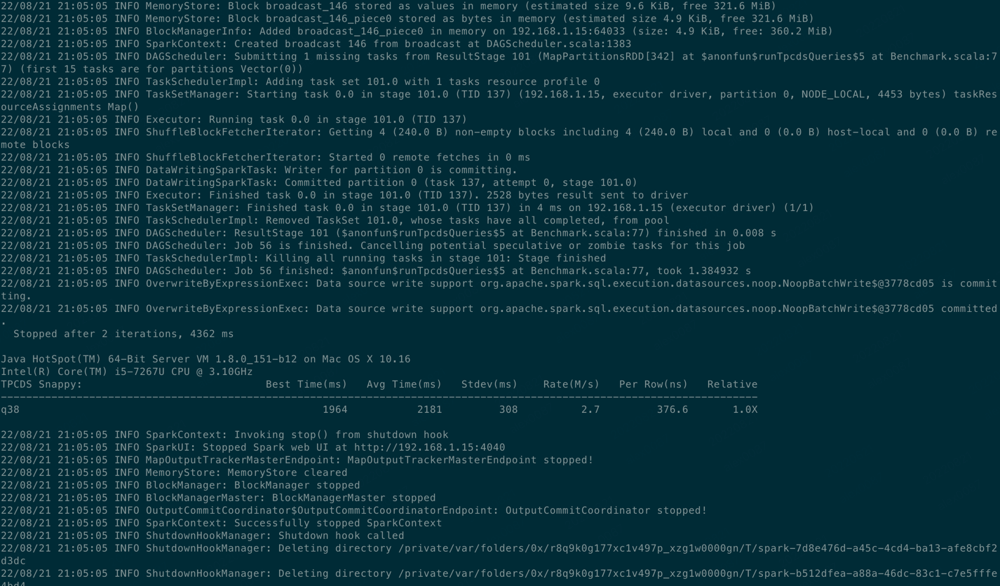
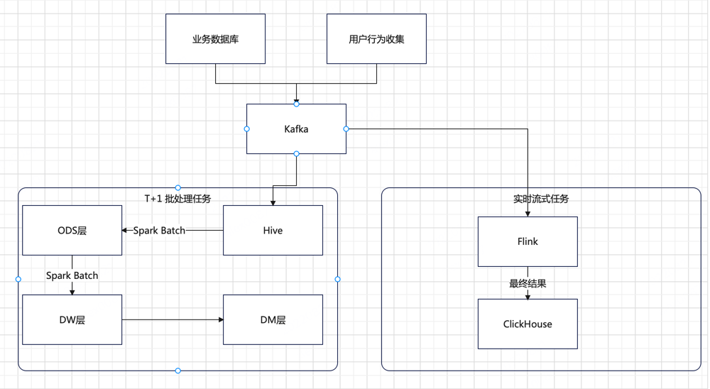

## 题目一：分析一条 TPCDS SQL

### 1. 先准备数据
```shell
1. 从 github 下载 TPCDS 数据生成器
git clone https://github.com/maropu/spark-tpcds-datagen.git
cd spark-tpcds-datagen
 
2. 下载 Spark3.1.1 到 spark-tpcds-datagen 目录并解压
wget https://archive.apache.org/dist/spark/spark-3.1.1/spark-3.1.1-bin-hadoop2.7.tgz
tar -zxvf spark-3.1.1-bin-hadoop2.7.tgz
 
3. 生成数据
mkdir -p tpcds-data-1g
export SPARK_HOME=./spark-3.1.1-bin-hadoop2.7
./bin/dsdgen --output-location tpcds-data-1g
```


### 2. 执行q38的SQL
```shell
./spark-3.1.1-bin-hadoop2.7/bin/spark-submit --class org.apache.spark.sql.execution.benchmark.TPCDSQueryBenchmark --jars spark-core_2.12-3.1.1-tests.jar,spark-catalyst_2.12-3.1.1-tests.jar spark-sql_2.12-3.1.1-tests.jar --data-location tpcds-data-1g --query-filter "q38"
```


该SQL 用到了如下规则：

=== Applying Rule org.apache.spark.sql.catalyst.optimizer.CollapseProject ===
=== Applying Rule org.apache.spark.sql.catalyst.optimizer.ColumnPruning ===
=== Applying Rule org.apache.spark.sql.catalyst.optimizer.ConstantFolding ===
=== Applying Rule org.apache.spark.sql.catalyst.optimizer.EliminateLimits ===
=== Applying Rule org.apache.spark.sql.catalyst.optimizer.InferFiltersFromConstraints ===
=== Applying Rule org.apache.spark.sql.catalyst.optimizer.PushDownLeftSemiAntiJoin ===
=== Applying Rule org.apache.spark.sql.catalyst.optimizer.PushDownPredicates ===
=== Applying Rule org.apache.spark.sql.catalyst.optimizer.RemoveNoopOperators ===
=== Applying Rule org.apache.spark.sql.catalyst.optimizer.ReorderJoin ===
=== Applying Rule org.apache.spark.sql.catalyst.optimizer.ReplaceDistinctWithAggregate ===
=== Applying Rule org.apache.spark.sql.catalyst.optimizer.ReplaceIntersectWithSemiJoin ===
=== Applying Rule org.apache.spark.sql.catalyst.optimizer.RewritePredicateSubquery ===

### 3. 选择 PushDownPredicates 和 ReorderJoin 这两条规则

PushDownPredicates 这个规则通过其他的操作把 filter 操作下推到离数据源更近的地方，将计算转移至数据源端，减少 spark 加载和计算的数据量，但不是所有的操作都支持。

ReorderJoin 这个规则是对 Join 操作进行重新排列，有两种做法。一种是逻辑上的转换，即将在 where 中涉及到两个表关联或者 filter 的条件提前至相应的 join 操作中，减少参与 join 的数据量以及最终 join 结果的数据量。还有一种做法是基于成本的做法，通过启用成本优化器，以及对 join 的表进行统计，spark 会根据 join 的成本选择代价最小的 join 方式。


## 题目二：Lambda 架构设计

### 1. Lambda 架构图


### 2. 什么是Lambda架构
Lambda 架构是一种数据处理架构，通过利用批处理和流处理方法来处理大量数据。这种架构方法通过使用离线批处理来提供批处理数据的全面和准确的视图，同时使用实时流处理来提供在线数据的视图来平衡延迟、吞吐量和容错性，两个视图输出可以在呈现之前合并。
Lambda 架构的兴起与大数据的增长、实时分析以及减少延迟的驱动力相关。
流处理计算的指标批处理也会计算，最终以批处理为准，即每一次批处理计算之后的结果会覆盖流处理的结果，这是对流处理引擎的一种补充方式（实时计算的结果一般来说没有离线计算的准确）。

### 3. Lambda架构优缺点
- 优点：
Lambda 架构的好处就是架构比较简单
对数据修正纠错也很友好，如果后期数据统计口径发生了变化，可以通过重新运行离线任务，从而很快的将历史数据修正纠错为最新的口径
- 缺点：
使用 Lambda 架构时，架构师需要同时维护两个复杂的分布式系统，并且保证他们逻辑上产生相同的结果输出到服务层中。
在分布式框架中进行编程其实是十分复杂的，尤其是我们还会针对不同的框架进行专门的优化，Lambda 架构在实战中维护起来具有一定的复杂性。